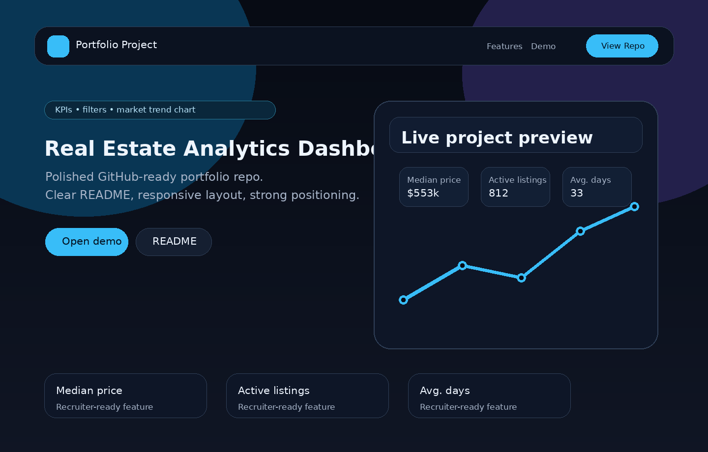

# 📊 Real Estate Analytics Dashboard

> A BI-style analytics dashboard that transforms raw housing market data into clear, actionable insights — built for Data Analyst and Business Intelligence portfolios.

Built by **Arsim Shefkiu** under **FullStackWithAI** — full-stack, AI-assisted, and data-driven web solutions.

🔗 **[Live Demo](https://fullstackwithai.github.io/real-estate-analytics-dashboard/)** &nbsp;|&nbsp; 👤 **[Portfolio](https://www.designhubmk.com)** &nbsp;|&nbsp; 💼 **[LinkedIn](https://www.linkedin.com/in/arsim-shefkiu-78432a3b5)**

---



---

## 🧠 What This Project Demonstrates

This project is designed to show real Data Analyst and BI Analyst skills:

- Translating raw datasets into stakeholder-ready visual dashboards
- Building interactive filters that update KPIs and charts in real time
- Presenting housing market trends clearly without a backend dependency
- Clean, accessible dashboard UI following BI design principles

---

## ✅ Features

- **KPI Cards** — Avg. price, total listings, median days on market, price per sqft
- **City Filter** — Dynamically filters all metrics and charts by market
- **Metric Selector** — Switch between price, volume, and trend views
- **SVG Line Chart** — JavaScript-rendered trend visualization, no library dependencies
- **Source Data Table** — Full underlying dataset visible and sortable
- **Included Dataset** — Local JSON-style housing market sample data
- **Responsive Layout** — Works across desktop, tablet, and mobile

---

## 🛠 Tech Stack

| Layer | Technology |
|---|---|
| Structure | HTML5 |
| Styling | CSS3 / Flexbox / Grid |
| Logic | Vanilla JavaScript |
| Charts | SVG (hand-rendered via JS) |
| Data | Local JSON dataset |

---

## 🚀 Run Locally

```bash
# Option 1 — Open directly
open index.html

# Option 2 — Local server
npx http-server .
```

---

## 📁 Project Structure

```
real-estate-analytics-dashboard/
├── index.html          # Main dashboard
├── assets/
│   └── screenshot.png  # Preview image
├── data/
│   └── housing.json    # Sample dataset
└── README.md
```

---

## 🔮 Planned Improvements

- [ ] CSV upload for custom datasets
- [ ] PostgreSQL backend integration
- [ ] Downloadable PDF/Excel reports
- [ ] Power BI-style drilldown views
- [ ] Additional market comparison views

---

## Creator & Brand

<p align="center">
  
  
  
</p>

### Built by **Arsim Shefkiu** under **FullStackWithAI**

> **PropTech analytics dashboard for turning housing market data into clear trends, market comparisons, and investor-ready insights.**

| Brand Direction | Portfolio Value |
|---|---|
| **Real estate market intelligence** | Shows ability to analyze property data and present market movement clearly |
| **BI-style dashboard design** | Demonstrates KPI selection, chart thinking, and stakeholder-ready reporting |
| **Interactive filtering** | Shows practical frontend/data interaction for city and metric views |
| **Investor-ready storytelling** | Positions the project for real estate, finance, and analytics audiences |

**Professional Focus:** I build analytics dashboards that translate market data into business-friendly insight, visual clarity, and decision support.

**Why it matters:** Hiring managers and executives can see that this project connects data analysis with real business use cases in property, investment, and market strategy.

<p align="center">
  <a href="https://www.designhubmk.com"><strong>www.designhubmk.com</strong></a> · <strong>arsim@designhubmk.com</strong> · <a href="https://github.com/fullstackwithai"><strong>GitHub: fullstackwithai</strong></a>
</p>

<p align="center">
  <strong>FullStackWithAI</strong> · PropTech analytics · Market intelligence · BI dashboards · AI-assisted product thinking
</p>
